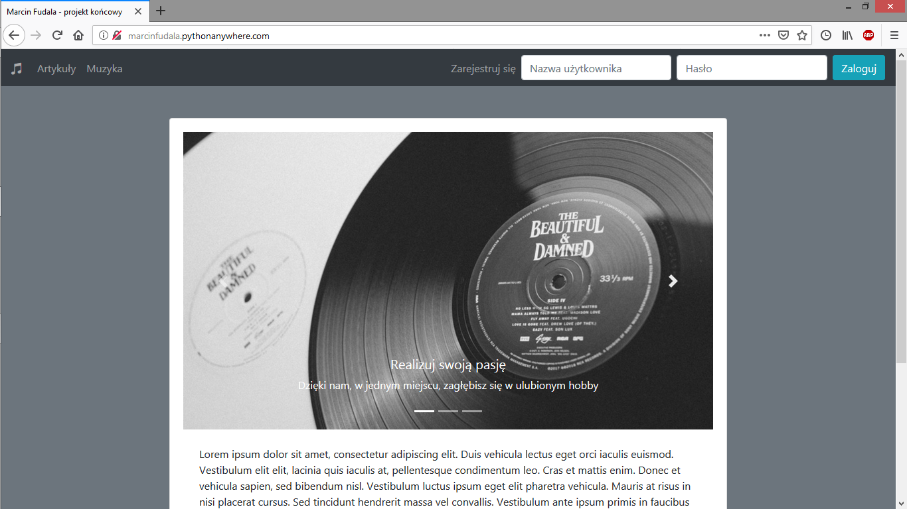

# Final_project_Music_site_project

Final project. Website about music - allows to read, post articles, check music database eg. bands, albums etc. Creating users, write comments.

 - Used tools and technologies: Python, Django, django-crispy-forms, django-multiselectfield, Faker, tqdm, JQuery, Quill Rich Text Editor, Bootstrap 4
 

To run this project you have to:
1. Clone repository.
2. cd to it.
3. Find settings.py file inside project directory.
4. Set correct Django's secret key and debug.
3. Create virtual environment.
4. Run `pip install -r requirements.txt`.
6. Run `python manage.py migrate`.
7. Run `python manage.py runserver`. You can create superuser before.

For development use, change database settings, currently it's set to SQLite.

There are fake example data generators in urls, you can access them only as superuser.
